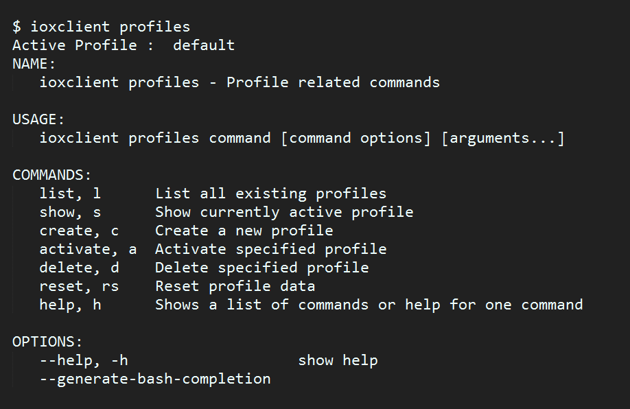

### Please note that we had issues running Docker containers with iox-vm 15.6.3M2 version.

## GETTING STARTED with Cisco IOx

#### Cisco IOx is Cisco’s implementing of “Fog Computing”, that supports running applications as software containers.
#### The following guide is an outline how to get your applications running on Cisco IR809 Router using Docker containers and ioxclient.

## 1- Install and configure Docker:
#### Detailed instructions can be found [here](https://docs.docker.com/engine/installation/)

#### After installing Docker on Windows you might need to include it in the system variables, so it can be run through the command prompt.
## 2- install and configure ioxclient: 
## What is ioxclient: 
#### It is a client from Cisco to "convert" the Docker containers so they can be run on IOx platform (in this case the IR809)

#### ioxclient [download](https://software.cisco.com/download/release.html?i=!y&mdfid=286306005&softwareid=286306762&release=1.0.0&os=) 

#### Please make sure to download the latest version that supports the docker commands.
		
#### Detailed instructions can be found [here](https://developer.cisco.com/media/iox-dev-guide-11-28-16/ioxclient/ioxclient-reference/#commands-for-docker-workflow)
## 3- Write your code in you favorite language:
#### Python was used in this project. It's lighter and easier to use for the app I did
	
## 4- Creat Docker image: 
#### To create Docker image we need:
### 1- Dockerfile: 
#### Which tells Docker machine which layers we want to add on top of our code to make it a self-contained application.

#### More detailes on how to creat Dockerfile for a python image can be found [here](https://hub.docker.com/_/python/)  

#### After choosing your favorite image you can build on top of it(you can add libraries, modules, etc) and the final Docker file should look like this: 

	
#### Make sure that the Dockerfile name starts with Uppercase and it is identical to this "Dockerfile"
#### *Please note that some images need requirments.txt file.You can find more details about this by visiting [Dockerhub Library](https://hub.docker.com/_/python/)

### 2- Build the image: 
#### Before you do anything, make sure that you have this file structure for you code and you Dockerfile: 

#### ./youWorkingDirectory/Dockerfile

#### ./youWorkingDirectory/yourcode.py

#### in other words, the Dockerfile and your code or your app should be on the same level(in the same folder).

#### From you command line, go to your project directory then use the following command to build you image: 

#### - docker build -t <image_tag> . 

##### - (-t) is a flag to add (image-tag) which is a name you for your image (Please note that if you're going to push the image to your Docker hub, the tag has to be (yourUserName/your-image-tag)

##### - (.) tells docker to search your folder for the Dockerfile.
		
## 5- IOx package: 

### 1- Creat a profile for ioxclient

#### The list of ioxclient profiles options looks like: 

 

#### You shouldn't change any settings when creating a profile except of the platform IP adress and your organisation name and website (optional).

#### Use (ioxclient profile cr) to creat a new profile.

### 2- Creat package.yaml file inside your project file folder:
#### ./youWorkingDirectory/package.yaml

#### it should look somthing like this:

### 3- Creat the IOx package:
#### - use the command: ioxclient docker package -a image-name project-dir 
##### -a flag is to automatically choose the type of the container.

### Example:

 

### 4- Install the container on the IOx platform: 
#### - use the command (ioxclient app --help) to get all the available subcommands to control the lifecycle for you application.

#### use (ioxclient app install <app-name> <path-to-package>) to deploy the container on the IOx platform.

### 5- Activate the container by either: using the ioxclient from command line (ioxclient app activate <app-name>) or you can use your browser, go to your IOx platform IP address and use the Cisco IOx Local Manager to control the containers on your IOx platform. 

#### Example for Cisco IOx Local Manager:

